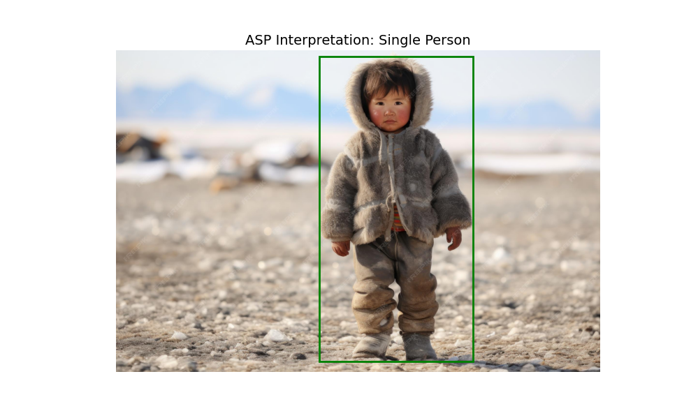

# Tensorized ASP: Neuro-Symbolic Reasoning with Geometric Evidence

This repository contains the experimental code accompanying the paper:

"Attention-Aware Geometric Answer Set Programming"

## Requirements

- Conda (recommended) or Python ≥ 3.10
- NVIDIA GPU (optional, CPU supported)
- clingo ≥ 5.6
- PyTorch
- sentence-transformers
- ultralytics (YOLOv8)

## Setup (Conda)

```bash
conda env create -f environment.yml
conda activate tensorasp
```

## Experiment 1: Text-based Involvement Reasoning

To test the experiment in the context of Occupational Therapy, go to the folder `/experiment1` and run the main Python file:

```bash
cd experiment1/
python main7.py
```

**Expected output:**
- Answer sets per epoch
- Learning curve
- Natural language interpretation
- Visualization window

The command-line output will display the following log:

```bash
asp/program2.lp:36:5-18: info: atom does not occur in any rule head:
  rel_object(c)

asp/program2.lp:37:5-15: info: atom does not occur in any rule head:
  eng_rel(c)

[Epoch 7] Noise=0.22 Loss=0.50
[['eng_rel', 'high_time', 'rel_object']]

-------------------------RQ1 — Mapping geometric → symbolic-------------------------
Final projections: {'rel_object': True, 'eng_rel': True, 'high_time': True}

-------------------------RQ2 — Fixed-point convergence-------------------------
Answer sets stabilized in last epochs:
[['eng_rel', 'high_time', 'rel_object']]
[['eng_rel', 'high_time', 'rel_object']]
[['eng_rel', 'high_time', 'rel_object']]

-------------------------RQ3 — NAF ambiguity-------------------------
Early vs late answer sets:
Epoch 0: [['eng_rel', 'high_time', 'rel_object']]
Epoch -1: [['eng_rel', 'high_time', 'rel_object']]

-------------------------RQ4 — Overhead / Learning stats-------------------------
Epochs: 8
Final thresholds: {'rel_object': 0.35, 'eng_rel': 0.4, 'high_time': 0.5}
Loss trajectory: [0.5, 0.5, 0.5, 0.5, 0.5, 0.5, 0.5, 0.5]

-------------------------Natural Language Interpretation-------------------------

Atom → Interpretation
- rel_object: The child is interacting with a relevant object
- eng_rel: The child is socially or contextually engaged
- high_time: The child spent a sustained amount of time
- full_involv: The child was fully involved
- part_involv: The child was partially involved

Interpretation:
Based on the interview text, the system inferred that the child interacted with a relevant object (ball), remained engaged with the activity context, spent a sustained amount of time in the activity (football field).
This pattern suggests limited or uncertain involvement.
```

## Experiment 2: Vision-based Person Reasoning (YOLO)
To test the experiment using YOLOv8 generating Answer Sets, go to the folder /experiment2 as follows:

```bash
cd experiments2/
python experiment2_yolo_person.py
```

**Expected output:**
- YOLO detections
- ASP answer sets
- Visual overlays corresponding to symbolic conclusions


The command-line output will display the following log and additionally an image as follows:




```bash
==================== STARTING EXPERIMENT 2: YOLO PERSON ====================

Image: img1.jpg

image 1/1 experiments/experiment2/images/img1.jpg: 384x640 4 persons, 2 cups, 44.6ms
Speed: 1.7ms preprocess, 44.6ms inference, 9.2ms postprocess per image at shape (1, 3, 384, 640)
YOLO confidences: [0.9422338604927063, 0.9382684826850891, 0.9350584745407104, 0.607587993144989]
ASP facts: ['person_detected.', 'multiple_people.', 'crowded.']
Answer sets: [{'group_scene', 'crowded', 'multiple_people', 'person_detected'}]
Image: img2.jpg

image 1/1 experiments/experiment2/images/img2.jpg: 448x640 2 persons, 1 sports ball, 42.9ms
Speed: 1.7ms preprocess, 42.9ms inference, 0.8ms postprocess per image at shape (1, 3, 448, 640)
YOLO confidences: [0.9173774123191833, 0.5124923586845398]
ASP facts: ['person_detected.', 'multiple_people.']
Answer sets: [{'group_scene', 'crowded', 'multiple_people', 'person_detected'}]
Image: img3.jpg

image 1/1 experiments/experiment2/images/img3.jpg: 448x640 1 person, 3.9ms
Speed: 1.5ms preprocess, 3.9ms inference, 1.0ms postprocess per image at shape (1, 3, 448, 640)
YOLO confidences: [0.9486217498779297]
ASP facts: ['person_detected.']
asp/person_reasoning.lp:13:9-24: info: atom does not occur in any rule head:
  multiple_people

asp/person_reasoning.lp:17:5-20: info: atom does not occur in any rule head:
  multiple_people

Answer sets: [{'single_person_scene', 'normal_activity', 'person_detected'}]

==================== FINAL INTERPRETATION ====================
This experiment demonstrates:
- YOLO performs low-level perception
- ASP reasons over symbolic projections
- Answer sets control semantic visualization
- No neural retraining is required
```